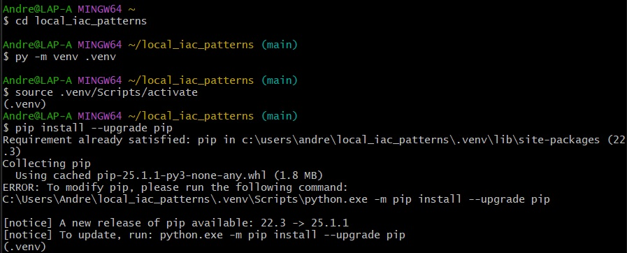
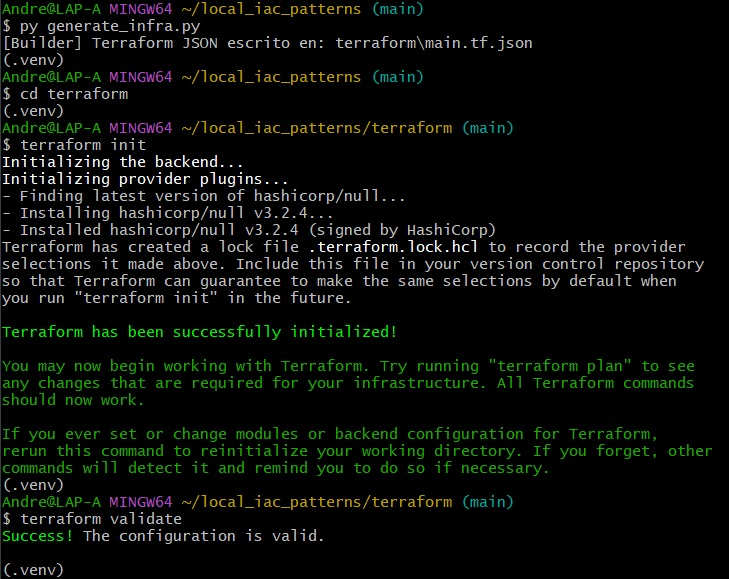
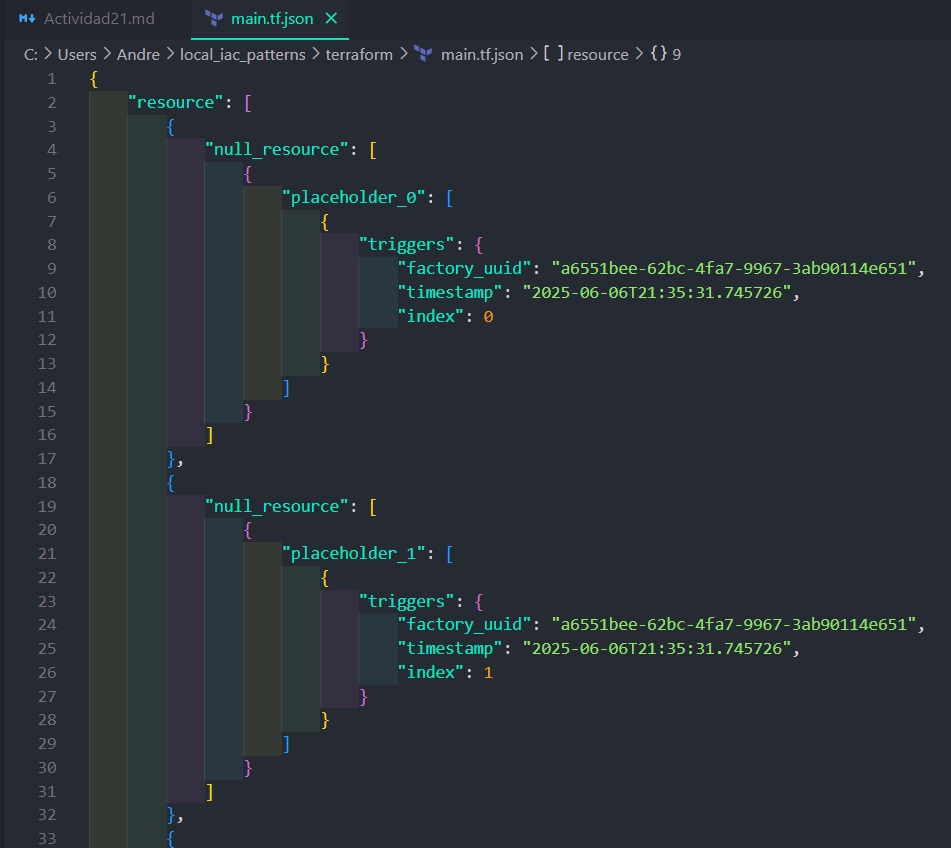
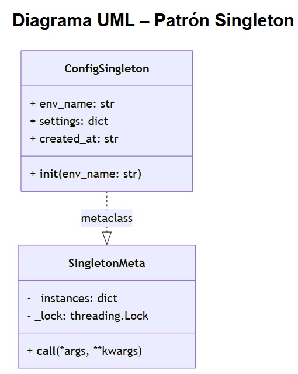
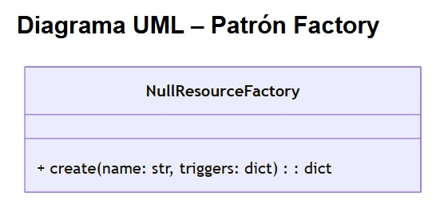
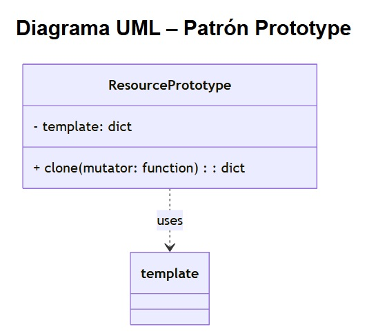
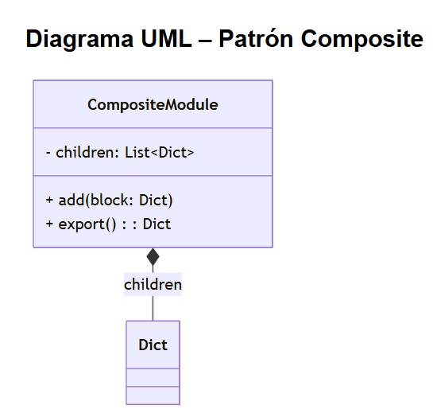
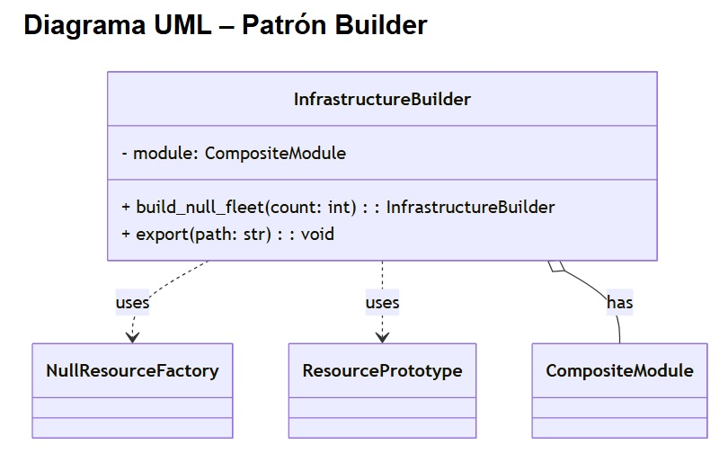

### Actividad: Patrones para módulos de infraestructura

En esta actividad: 
1. Profundizaremos en los patrones **Singleton**, **Factory**, **Prototype**, **Composite** y **Builder** aplicados a IaC.
2. Analizaremos y extenderemos el código Python existente para generar configuraciones Terraform locales.
3. Diseñaremos soluciones propias, escribir tests y evaluar escalabilidad.


#### Fase 0: Preparación
Utiliza para esta actividad el siguiente [proyecto](https://github.com/kapumota/DS/tree/main/2025-1/local_iac_patterns) como referencia.

1. **Configura** el entorno virtual:

   ```bash
   cd local_iac_patterns
   python -m venv .venv && source .venv/bin/activate
   pip install --upgrade pip
   ```
   

2. **Genera** la infraestructura base y valida:

   ```bash
   python generate_infra.py
   cd terraform
   terraform init
   terraform validate
   ```

      
3. **Inspecciona** `terraform/main.tf.json` para ver los bloques `null_resource` generados.
   
   
   Se muestra el JSON generado por `generate_infra.py`. Se creó el arreglo de objetos `resource`, que dentro de este tenemos en total 15 objetos `null_resource` que tienen la misma estructura a excepción del ultimo que es el `finalizador`, que indica que se terminó la generación de la flota.

#### Fase 1: Exploración y análisis

Para cada patrón, localiza el archivo correspondiente y responde (los códigos son de referencia):

##### 1. Singleton

```python
# singleton.py
import threading
from datetime import datetime

class SingletonMeta(type):
    _instances: dict = {}
    _lock: threading.Lock = threading.Lock()

    def __call__(cls, *args, **kwargs):
        with cls._lock:
            if cls not in cls._instances:
                instance = super().__call__(*args, **kwargs)
                cls._instances[cls] = instance
        return cls._instances[cls]

class ConfigSingleton(metaclass=SingletonMeta):
    def __init__(self, env_name: str):
        self.env_name = env_name
        self.settings: dict = {}
        self.created_at: str = datetime.utcnow().isoformat()
```

* **Tarea**: Explica cómo `SingletonMeta` garantiza una sola instancia y el rol del `lock`.

`SingletonMeta` lo que hace es primero un registro de instancias:
- `_instances`: diccionario privado que guarda, para cada clase, su única instancia creada.  
- Al invocar `ConfigSingleton("dev")`, se llama internamente a `SingletonMeta.__call__`.

Luego se hace un chequeo antes de crear:
Dentro de `__call__` se comprueba:

```python
if cls not in cls._instances:
    # crea nueva instancia y la guarda en _instances[cls]
```
- Si la clase no existe en `_instances`, se crea la instancia y se almacena.

- Si ya existe, se devuelve directamente la instancia existente sin volver a llamar a `__init__`.

El rol de lock `_lock` es un candado `(threading.Lock)` que envuelve toda la comprobación y posible creación:
```python
with cls._lock:
    # sección crítica: comprobar y crear
```
- Impide que dos hilos entren al mismo tiempo y creen dos objetos distintos.

- El primer hilo crea y guarda la instancia; el segundo encuentra la entrada en _instances y la reutiliza.



- ConfigSingleton es la clase a la que queremos aplicar el patrón Singleton.

- SingletonMeta es su metaclase, el controla cómo se crean las clases, y aquí intercepta toda llamada de instanciación.

La flecha punteada con estereotipo <<metaclass>> indica precisamente esa relación: “ConfigSingleton fue creado usando SingletonMeta como metaclase”.

#### 2. Factory

```python
# factory.py
import uuid
from datetime import datetime

class NullResourceFactory:
    @staticmethod
    def create(name: str, triggers: dict = None) -> dict:
        triggers = triggers or {
            "factory_uuid": str(uuid.uuid4()),
            "timestamp": datetime.utcnow().isoformat()
        }
        return {
            "resource": {
                "null_resource": {
                    name: {"triggers": triggers}
                }
            }
        }
```

* **Tarea**: Detalla cómo la fábrica encapsula la creación de `null_resource` y el propósito de sus `triggers`.

**Encapsulamiento de la creación**
- Método estático
`create(...)` puede llamarse sin instanciar `NullResourceFactory`, lo que simplifica su uso desde cualquier parte del código.

- Responsabilidad única
Toda la lógica de construcción del bloque Terraform JSON para un `null_resource` queda aquí, en lugar de repartirse por varios módulos o scripts. Así:
```python
base = NullResourceFactory.create("app")
# base → 
# {
#   "resource": {
#     "null_resource": {
#       "app": { "triggers": { … } }
#     }
#   }
# }
```
**Desacoplamiento**

Otros componentes (Prototype, Builder, Composite…) no necesitan conocer detalles de `uuid` ni de formato de timestamp: sólo llaman a `create(name)` y obtienen un bloque listo para usar.

**Propósito de los triggers**

Dentro de Terraform, triggers en un null_resource sirven para:

1. **Forzar recreación**
- Si cambias cualquiera de los valores en el mapa triggers, Terraform detecta una diferencia con la ejecución anterior y volverá a “apply” el recurso.

2. **Metadatos de generación**

- `factory_uuid`: Un UUID único por llamada a fábrica, que permite agrupar todos los recursos creados en esa misma ejecución.

- `timestamp`: Fecha y hora exacta (UTC) en que se generó el recurso, registrando cuándo se corrió la fábrica.



#### 3. Prototype

```python
# prototype.py
from copy import deepcopy
from typing import Callable

class ResourcePrototype:
    def __init__(self, template: dict):
        self.template = template

    def clone(self, mutator: Callable[[dict], None]) -> dict:
        new_copy = deepcopy(self.template)
        mutator(new_copy)
        return new_copy
```

* **Tarea**: Dibuja un diagrama UML del proceso de clonación profunda y explica cómo el **mutator** permite personalizar cada instancia.

1. **Propósito del patrón Factory**

    Permitir la creación de nuevos objetos a partir de una “plantilla” existente, sin conocer los detalles internos de construcción.

2. **Flujo de clonación**

    - Se guarda en `self.template` un diccionario que representa un bloque Terraform básico (p. ej. el JSON devuelto por la fábrica).

    - Al llamar a `clone(mutator` primero se realiza un deep copy, garantizando que la copia es totalmente independiente de la plantilla original.

    - Luego se aplica la función `mutator`, que recibe el diccionario clonado y puede:

        - Renombrar recursos

        - Ajustar triggers

        - Añadir bloques adicionales (por ejemplo, un bloque `local_file`)

    Finalmente se retorna la copia modificada, lista para integrarse en el módulo Composite.

3. **Ventajas**

    - Desacoplamiento: no hay lógica de “nombres” o “índices” dentro de la clase, solo un punto de extensión `(mutator)`.

    - Reutilización: el mismo `ResourcePrototype` puede producir múltiples instancias diferenciadas, aplicando mutators distintos.



`ResourcePrototype` almacena un atributo `template` (el prototipo original).

El método `clone()` toma un `mutator` (una función que modifica el bloque) y devuelve una copia independiente.

#### 4. Composite

```python
# composite.py
from typing import List, Dict

class CompositeModule:
    def __init__(self):
        self.children: List[Dict] = []

    def add(self, block: Dict):
        self.children.append(block)

    def export(self) -> Dict:
        merged: Dict = {"resource": {}}
        for child in self.children:
            # Imagina que unimos dicts de forma recursiva
            for rtype, resources in child["resource"].items():
                merged["resource"].setdefault(rtype, {}).update(resources)
        return merged
```

* **Tarea**: Describe cómo `CompositeModule` agrupa múltiples bloques en un solo JSON válido para Terraform.

1. **Agregación de bloques**

    - El atributo `children` es una lista donde se acumulan múltiple bloques de recurso (cada uno es un dict con la clave `"resource"`).

    - El método `add(block)` recibe uno de estos bloques y lo añade a la lista.

2. **Exportación unificada**

    - En `export()`, se crea un dict inicial `{"resource": {}}`.

    - Luego se itera sobre cada `child`:

        - Se extrae el tipo de recurso (`rtype`, p. ej. `"null_resource"` o `"module"`).

        - Se obtiene el mapa de recursos bajo ese tipo y se fusiona en el `merged`, usando `update()` para combinar varios nombres de recurso sin colisionar.

3. **Resultado**

    - El JSON resultante es un único objeto con todos los recursos agrupados por tipo.

    - Esto simula la sintaxis HCL en la que podrías tener varios bloques `resource "null_resource"` `"app_0" { … }` uno tras otro.



- CompositeModule tiene un atributo privado children que es una lista de Dict.

- El método add() añade un Dict a esa lista.

- El método export() recorre children para generar un único Dict de salida.

#### 5. Builder

```python
# builder.py
import json
from composite import CompositeModule
from factory import NullResourceFactory
from prototype import ResourcePrototype

class InfrastructureBuilder:
    def __init__(self):
        self.module = CompositeModule()

    def build_null_fleet(self, count: int):
        base = NullResourceFactory.create("app")
        proto = ResourcePrototype(base)
        for i in range(count):
            def mutator(block):
                # Renombrar recurso "app" a "app_<i>"
                res = block["resource"]["null_resource"].pop("app")
                block["resource"]["null_resource"][f"app_{i}"] = res
            self.module.add(proto.clone(mutator))
        return self

    def export(self, path: str = "terraform/main.tf.json"):
        with open(path, "w") as f:
            json.dump(self.module.export(), f, indent=2)
```

* **Tarea**: Explica cómo `InfrastructureBuilder` orquesta Factory -> Prototype -> Composite y genera el archivo JSON final.

1. **CompositeModule como contenedor**

    `self.module = CompositeModule()` crea un módulo que luego agregará todos los bloques.

2. **Factory**

    `NullResourceFactory.create("app")` devuelve el bloque JSON mínimo para un `null_resource "app"` con sus triggers.

3. **Prototype**

    `ResourcePrototype(base)` envuelve el bloque de fábrica para poder clonarlo sin alterar el original.

4. **Clonado y mutación**
    En el bucle:

    `proto.clone(mutator)` hace un deep copy de base.

    `mutator` renombra la clave `"app"` a `"app_{i}"`, dejando cada recurso con un nombre único.

5. **Composite**
    `self.module.add(...)` acumula cada copia en la lista interna de `CompositeModule`.

6. **Export**
    Al llamar `builder.export()`, todos los bloques añadidos se fusionan en un único JSON válido para Terraform y se escriben en `terraform/main.tf.json`.

Con este flujo, Builder orquesta los tres patrones:

- Factory genera el bloque base.

- Prototype permite múltiples instancias independientes a partir de ese bloque.

- Composite agrupa todas esas instancias en un único archivo de salida.



- InfrastructureBuilder depende de NullResourceFactory (para crear bloques), de ResourcePrototype (para clonarlos) y contiene un CompositeModule (para agregarlos todos).

- Así se visualiza cómo Builder orquesta los tres patrones y produce el JSON final.

> **Entregable fase 1**: Documento con fragmentos de código destacados, explicación de cada patrón y un diagrama UML simplificado.


#### Fase 2: Ejercicios prácticos 

Extiende el código base en una rama nueva por ejercicio:

#### Ejercicio 2.1: Extensión del Singleton

* **Objetivo**: Añadir un método `reset()` que limpie `settings` pero mantenga `created_at`.
* **Código de partida**:

  ```python
  class ConfigSingleton(metaclass=SingletonMeta):
      # ...
      def reset(self):
          # TODO: implementar
  ```
* **Validación**:

  ```python
  c1 = ConfigSingleton("dev")
  created = c1.created_at
  c1.settings["x"] = 1
  c1.reset()
  assert c1.settings == {}
  assert c1.created_at == created
  ```

#### Ejercicio 2.2: Variación de la Factory

* **Objetivo**: Crear `TimestampedNullResourceFactory` que acepte un `fmt: str`.
* **Esqueleto**:

  ```python
  class TimestampedNullResourceFactory(NullResourceFactory):
      @staticmethod
      def create(name: str, fmt: str) -> dict:
          ts = datetime.utcnow().strftime(fmt)
          # TODO: usar ts en triggers
  ```
* **Prueba**: Genera recurso con formato `'%Y%m%d'` y aplica `terraform plan`.

#### Ejercicio 2.3: Mutaciones avanzadas con Prototype

* **Objetivo**: Clonar un prototipo y, en el mutator, añadir un bloque `local_file`.
* **Referencia**:

  ```python
  def add_welcome_file(block: dict):
      block["resource"]["null_resource"]["app_0"]["triggers"]["welcome"] = "¡Hola!"
      block["resource"]["local_file"] = {
          "welcome_txt": {
              "content": "Bienvenido",
              "filename": "${path.module}/bienvenida.txt"
          }
      }
  ```
* **Resultado**: Al `terraform apply`, genera `bienvenida.txt`.

#### Ejercicio 2.4: Submódulos con Composite

* **Objetivo**: Modificar `CompositeModule.add()` para soportar submódulos:

  ```python
  # composite.py (modificado)
  def export(self):
      merged = {"module": {}, "resource": {}}
      for child in self.children:
          if "module" in child:
              merged["module"].update(child["module"])
          # ...
  ```
* **Tarea**: Crea dos submódulos "network" y "app" en la misma export y valida con Terraform.

#### Ejercicio 2.5: Builder personalizado

* **Objetivo**: En `InfrastructureBuilder`, implementar `build_group(name: str, size: int)`:

  ```python
  def build_group(self, name: str, size: int):
      base = NullResourceFactory.create(name)
      proto = ResourcePrototype(base)
      group = CompositeModule()
      for i in range(size):
          def mut(block):  # renombrar
              res = block["resource"]["null_resource"].pop(name)
              block["resource"]["null_resource"][f"{name}_{i}"] = res
          group.add(proto.clone(mut))
      self.module.add({"module": {name: group.export()}})
      return self
  ```
* **Validación**: Exportar a JSON y revisar anidamiento `module -> <name> -> resource`.

> **Entregable Fase 2**: Ramas Git con cada ejercicio, código modificado y logs de `terraform plan`/`apply`.


#### Fase 3: Desafíos teórico-prácticos

#### 3.1 Comparativa Factory vs Prototype

* **Contenido** (\~300 palabras): cuándo elegir cada patrón para IaC, costes de serialización profundas vs creación directa y mantenimiento.

#### 3.2 Patrones avanzados: Adapter (código de referencia)

* **Implementación**:

  ```python
  # adapter.py
  class MockBucketAdapter:
      def __init__(self, null_block: dict):
          self.null = null_block

      def to_bucket(self) -> dict:
          # Mapear triggers a parámetros de bucket simulado
          name = list(self.null["resource"]["null_resource"].keys())[0]
          return {
              "resource": {
                  "mock_cloud_bucket": {
                      name: {"name": name, **self.null["resource"]["null_resource"][name]["triggers"]}
                  }
              }
          }
  ```
* **Prueba**: Inserta en builder y exporta un recurso `mock_cloud_bucket`.

#### 3.3 Tests automatizados con pytest

* **Ejemplos**:

  ```python
  def test_singleton_meta():
      a = ConfigSingleton("X"); b = ConfigSingleton("Y")
      assert a is b

  def test_prototype_clone_independent():
      proto = ResourcePrototype(NullResourceFactory.create("app"))
      c1 = proto.clone(lambda b: b.__setitem__("foo", 1))
      c2 = proto.clone(lambda b: b.__setitem__("bar", 2))
      assert "foo" not in c2 and "bar" not in c1
  ```

#### 3.4 Escalabilidad de JSON

* **Tarea**: Mide tamaño de `terraform/main.tf.json` para `build_null_fleet(15)` vs `(150)`.
* **Discusión**: impacto en CI/CD, posibles estrategias de fragmentación.

#### 3.5 Integración con Terraform Cloud (opcional)

* **Esquema**: `builder.export_to_cloud(workspace)` usando API HTTP.
* **Diagrama**: Flujo desde `generate_infra.py` -> `terraform login` -> `apply`.

> **Entrega final**:
>
> * Informe comparativo y código de Adapter.
> * Suite de tests.
> * Análisis de escalabilidad.
> * (Opcional) Documento con flujo de integración a Terraform Cloud.